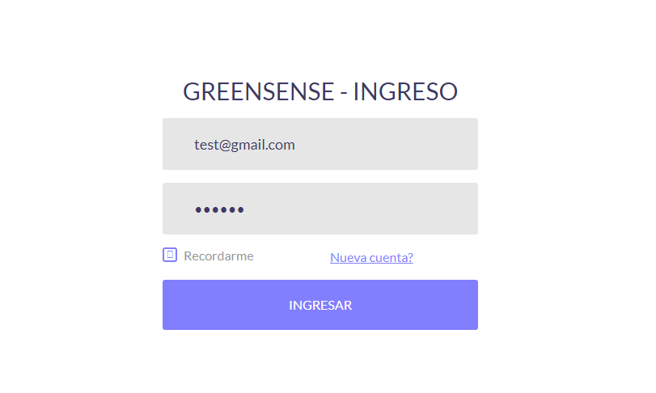
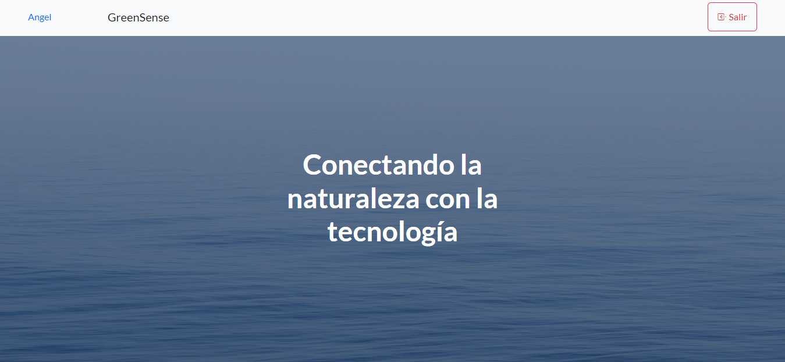
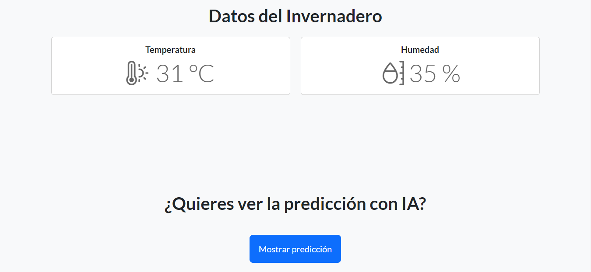
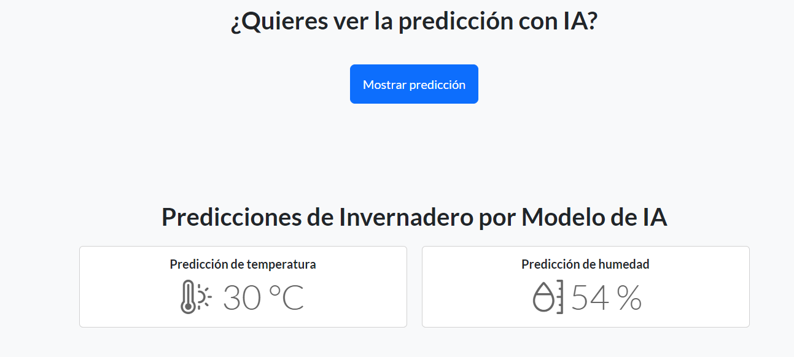

# IoT-project

## Propuesta del proyecto

Aplicación de monitoreo de tempertura y humedadad para ambientes de producción controlados.

El hardware a utilizar será tentativamente un ESP32 o un Arduino Mega 2560 con módulo WiFi y un sensor DHT11 de temperatura y humedad. También se contempla el uso de un display LCD 16x2 para mostrar los datos directamente en el embebido.

Además de mostrar los datos en el display, estará conectado a una aplicación web para el monitoreo remoto que mostrará los niveles de humedad y temperatura y alertará en caso de salir fuera de los valores permitidos con la posibilidad de activar actuadores para intentar controlar los factores ambientales que producen las mediciones fuera de rango. 

Se tomarán valores así como patrones pasados en el comportamiento de las lecturas para intentar predecir futuros valores fuera de rango y tener tiempo de mitigar los riesgos.

El objetivo de este proyecto tiene un enfoque más "industrial" a baja escala en donde es necesario mantener muy controlado los factores ambientales, ya sea para la producción o manejo de materiales.

### Especificación del proyecto
- Inicio de sesión
- Conexion con el ESP32/Arduino Mega 2560.
- Funciones de monitoreo de temperatura y humedad.
- Predicciones de temperatura y humedad por parte de una IA

Tecnologías de desarrollo (MERN Stack)
- React, JS
- IA: TensorFlow (tentativa)
- BD: Mongo

## GreenSense

La aplicacion cuenta con un login de inicio el cual esta conectado a una base de datos
una vez se carga se hace el login carga la pagina y se tiene acceso al monitoreo. En
caso de no tener cuenta hay un pequeño enlace donde se pregunta *Nueva cuenta?*, al dar
click se muestra la pagina del registro.

Si se registra un nuevo usuario se le hacen 3 sencillas preguntas de registro basico, de
igual manera tenemos un pequeño enlace que nos devuelve a la pagina de Login en caso de 
ya tener una cuenta.

Una vez registrado o realizado el login, se cargara la pagina donde se nos muestra un mensaje
general sobre el tema de IoT y tenemos nuestro nombre de usuario y un boton para salir de
la pagina.

Si nos desplazamos más hacia abajo podemos observar que tenemos lo que es los datos que esta 
capturando del invernadero; tanto la obtencion de datos de la temperatura como de la humedad
que registra y abajo de ello encontramos un boton donde se nos muestra la prediccion de la IA.

Prediccion por la IA

## Diagramas

### Diagrama a bloques

### Diagrama ISA

### Diagrama léctrico

## Fotografías del circuito armado

### Temperatura baja, foco encendido

### Temperatura ambiente, actuadores apagados

### Temperatura alta, ventilador encendido

### Sistema de riego encendido

## Video del funcionamiento
https://drive.google.com/file/d/1ONmR1QUjAyrAPzsgKlDip1_yZWKDfttD/view?usp=sharing
